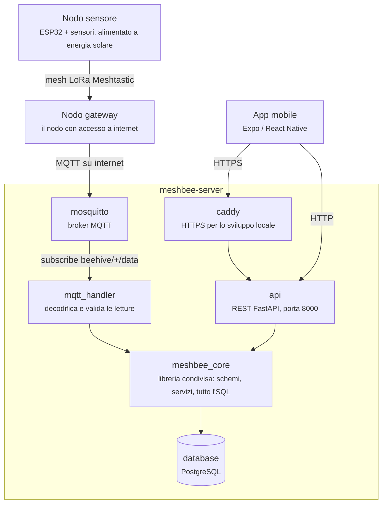

# Architettura

Come una lettura arriva da un'arnia in un campo fino a uno smartphone.

I nodi arnia comunicano tra loro su una **mesh LoRa Meshtastic** — nell'apiario
non serve WiFi. Una lettura salta di nodo in nodo finché non raggiunge un nodo con accesso a
internet, che fa da gateway e la inoltra al **broker MQTT** su una normale connessione internet.

`caddy` termina l'HTTPS davanti all'API sulla porta `:8443`. Serve per lo sviluppo locale ed è
opzionale: in un `docker-compose up` semplice l'app parla direttamente con `api` su `:8000`.

## Perché è costruita così

Il ragionamento che guida gran parte del progetto: **il parco nodi è eterogeneo.**

Un nodo è una scheda fissata a un pannello solare in un campo. Non esiste un modo affidabile per
inviargli un aggiornamento. Alcuni nodi continueranno a usare il firmware dell'anno scorso
finché sopravvivono fisicamente. Non c'è nessun giorno X, nessun aggiornamento coordinato,
nessun momento in cui tutti i nodi eseguono lo stesso codice.

Quindi il sistema non può dare per scontato nulla su chi sta dall'altra parte di un messaggio.
Glielo deve dire il messaggio stesso. Da qui tre conseguenze volute:

- **Il payload MQTT porta con sé un intero di versione** (`v`), così il server decide la
  compatibilità **per messaggio**, non per deployment. Un nodo vecchio e uno nuovo potrebbero
  pubblicare sullo stesso broker nello stesso momento ed essere gestiti entrambi correttamente.
- **L'API HTTP è versionata nel percorso** (`/v1/`). Le release dell'app in circolazione hanno lo
  stesso problema dei nodi: gli utenti aggiornano quando ne hanno voglia. Un'app vecchia continua
  a chiamare l'endpoint per cui è stata costruita.
- **Una [matrice di compatibilità](contract/compatibility.md)** registra quali versioni di
  firmware / server / app funzionano insieme, perché "compila" e "va d'accordo con ciò che è già
  installato sul campo" sono due domande diverse.

!!! warning "Intenzione di progetto, non comportamento attuale"

    I primi due punti descrivono dove sta andando l'interfaccia, non dove si trova adesso. Oggi il
    payload **non** porta alcun intero di versione — l'handler legge un insieme fisso di campi — e
    l'API è servita sotto `/api/…` **senza** alcun segmento di versione nel percorso. La matrice di
    compatibilità invece è reale ed è mantenuta. Vedi [il contratto](contract/index.md) per quello
    che viene effettivamente rilasciato.

## Dove sta cosa

Solo i due estremi della catena stanno fuori da `meshbee-server`: i nodi sono
[`meshbee-firmware`](https://github.com/fablab-imperia/meshbee-firmware) su
[`meshbee-hardware`](https://github.com/fablab-imperia/meshbee-hardware), e lo smartphone è
[`meshbee-app`](https://github.com/fablab-imperia/meshbee-app). Tutto ciò che sta nel riquadro qui
sopra è un solo repository. Ogni pezzo ha una pagina breve nella sezione
**[Componenti](components/index.md)**.

Due regole strutturali spiegano la forma del server:

- **Due processi, una libreria.** `api` e `mqtt_handler` sono container separati con cicli di vita
  separati: riavviare il broker non tocca l'API REST, e l'API non è un client MQTT. Ma scrivono
  sullo stesso database, quindi devono essere d'accordo su cosa sia una lettura valida e su come
  salvarla. Quell'accordo è `meshbee_core`: importato da entrambi, mai deployato da solo.
- **Tre livelli, una direzione.** L'SQL sta in `meshbee_core/repository/`; le decisioni stanno in
  `meshbee_core/services/`, che non sanno nulla di HTTP; i punti di ingresso validano l'input,
  chiamano un solo servizio e traducono l'esito in uno status code o in una riga di log.

Il [contratto](contract/index.md) è l'interfaccia tra i blocchi qui sopra: è la parte che non deve
cambiare alla leggera.
