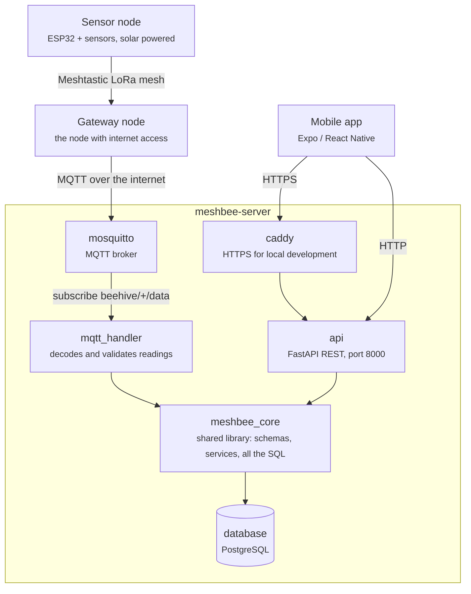

# Architecture

How a reading gets from a hive in a field to a phone.

Two legs, not one. Hive nodes talk to each other over a **Meshtastic LoRa mesh** — no WiFi needed
in the apiary. A reading hops across the mesh until it reaches a node with internet access, which
acts as the gateway and forwards it to the **MQTT broker** over an ordinary internet connection.

`caddy` terminates HTTPS in front of the API on `:8443`. It is there for local development and is
optional — in a plain `docker-compose up` the app talks to `api` directly on `:8000`.

## Why it's built this way

The rationale that drives most of the design: **the node fleet is permanently heterogeneous.**

A node is a board bolted to a solar panel in a field. There is no reliable way to push an update
to it. Some nodes will run last year's firmware for as long as they physically survive. There is
no flag day, no coordinated upgrade, no moment where every node runs the same code.

So the system cannot assume anything about what's on the other end of a message. It has to be
told, by the message itself. That gives us three intended consequences:

- **The MQTT payload carries a version integer** (`v`), so the server can decide compatibility
  **per message**, not per deployment. An old node and a new node could publish to the same broker
  at the same time and both get handled correctly.
- **The HTTP API is path-versioned** (`/v1/`). App releases in the wild have the same problem as
  nodes: users update when they feel like it. An old app keeps hitting the endpoint it was built
  against.
- **A [compatibility matrix](contract/compatibility.md)** records which firmware / server / app
  versions are known to work together, because "it builds" and "it interoperates with what's
  already deployed" are different questions.

!!! warning "Design intent, not current behaviour"

    The first two points describe where the interface is going, not where it is. Today the payload
    carries **no** version integer — the handler reads a fixed set of fields — and the API is served
    under `/api/…` with **no** version segment in the path. The compatibility matrix is real and
    maintained. See [the contract](contract/index.md) for what actually ships.

## Where things live

Only the two ends of the chain live outside `meshbee-server`: the nodes are
[`meshbee-firmware`](https://github.com/fablab-imperia/meshbee-firmware) on
[`meshbee-hardware`](https://github.com/fablab-imperia/meshbee-hardware), and the phone is
[`meshbee-app`](https://github.com/fablab-imperia/meshbee-app). Everything in the box above is one
repository. Each piece gets a short page under **[Components](components/index.md)**.

Two structural rules explain the shape of the server:

- **Two processes, one library.** `api` and `mqtt_handler` are separate containers with separate
  lifecycles — restarting the broker doesn't touch the REST API, and the API is not an MQTT client.
  But they write to the same database, so they must agree on what a valid reading is and how to
  store one. That agreement is `meshbee_core`: imported by both, never deployed on its own.
- **Three layers, one direction.** SQL lives in `meshbee_core/repository/`; decisions live in
  `meshbee_core/services/`, which know nothing about HTTP; the entry points validate input, call
  one service, and translate the outcome into a status code or a log line.

The [contract](contract/index.md) is the interface between the boxes above — it's the part that
must not change casually.
